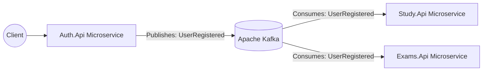

# ADR 001: Move from Monolith to Event-Driven Microservices

## Status
Accepted

## Context
Version 1 of EscolhaMúltipla was built as a quick monolith. While this worked well for a weekend project, adding new features (like complex grading, study areas, and subscriptions) made the codebase hard to maintain. Also, if one part of the app crashed (like a heavy PDF export), the whole platform went down. I wanted to separate concerns so that different parts of the system can scale and be deployed independently.

## Decision
I decided to split the application into **Microservices** and use **Apache Kafka** as an event broker to communicate between them. 

For example, when a new user registers in the `Auth.Api`, we don't make a direct API call to the `Study.Api`. Instead, we publish a `UserRegistered` event to Kafka.

## Consequences
* **Pros:** 
  * Services are fully decoupled. If `Study.Api` goes down, `Auth.Api` still allows users to login.
  * Better scalability (we can scale the exam engine separately from the auth engine).
* **Cons:** 
  * More complex infrastructure (need to run Kafka and Zookeeper/Kraft in Docker).
  * Debugging requires looking at distributed logs instead of a single server.

## Diagram

