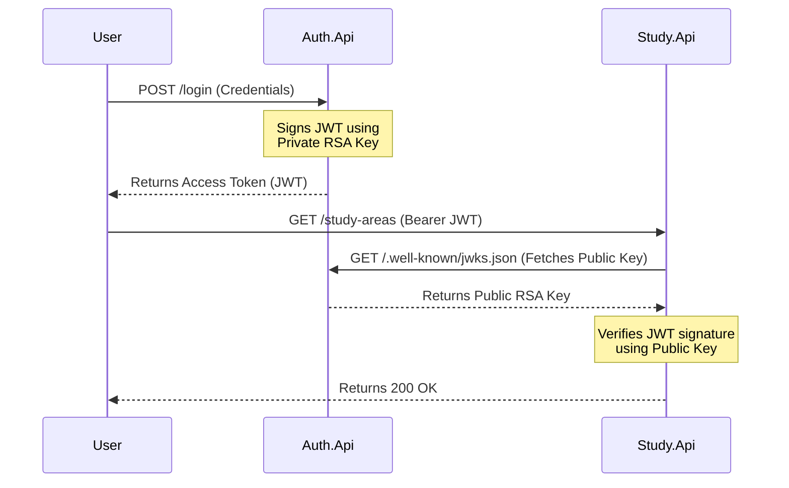

# ADR 003: Use Asymmetric RSA Keys for JWTs (JWKS)

## Status
Accepted

## Context
Usually, in simple APIs, we sign JWTs using a Symmetric Key (a single secret string like `MySuperSecretKey`). However, in a microservices architecture, if `Auth.Api` generates the JWT, how does `Study.Api` verify it? If we use a symmetric key, we have to share the secret string with *every* microservice. If one microservice gets hacked, the secret is compromised, and the hacker can forge admin tokens.

## Decision
I decided to use **Asymmetric RSA Keys**. 
* `Auth.Api` holds the **Private Key** and uses it to *sign* the tokens.
* `Auth.Api` exposes a public endpoint (`/.well-known/jwks.json`) containing the **Public Key**.
* Other microservices fetch the Public Key from the JWKS endpoint to *verify* the tokens.

## Consequences
* **Pros:** 
  * Huge security boost. Downstream services never see the private key.
  * Easy key rotation. We can just add a new public key to the JWKS endpoint.
* **Cons:** 
  * Slightly more complex to set up in .NET compared to a simple symmetric string.
  * RSA signing is computationally heavier than HMAC (symmetric).

## Diagram

