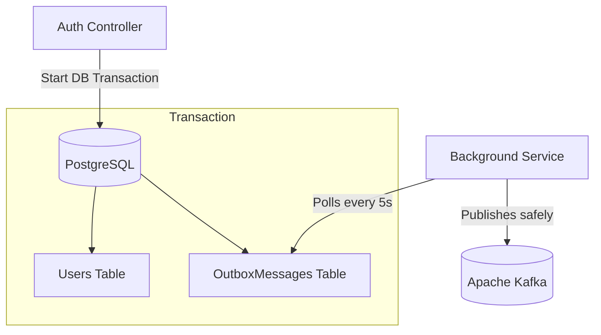

# ADR 004: Transactional Outbox Pattern for Kafka Events

## Status
Accepted

## Context
When a user registers, we need to save them to the PostgreSQL database AND send an event to Kafka. If we save to the database, and then the Kafka server is temporarily down, the event is lost. This creates an inconsistency (the user exists in Auth, but the Study service doesn't know about them). This problem is known as "Dual Writing."

## Decision
To solve this, I implemented the **Transactional Outbox Pattern**.
Instead of sending to Kafka directly, we save the event to an `OutboxMessages` table in the *same database transaction* as the user creation. 

Later, a separate background worker reads from the `OutboxMessages` table and safely publishes the events to Kafka.

## Consequences
* **Pros:** 
  * **Guaranteed Delivery (At-Least-Once):** We will never lose an event because it is tied to the ACID transaction of the database.
  * System resilience. If Kafka is down, the outbox messages just queue up in Postgres until Kafka comes back online.
* **Cons:** 
  * Requires building a background worker to poll the table.
  * Messages might be sent more than once if the worker crashes after sending but before marking it as processed (Idempotency needed downstream).

## Diagram

