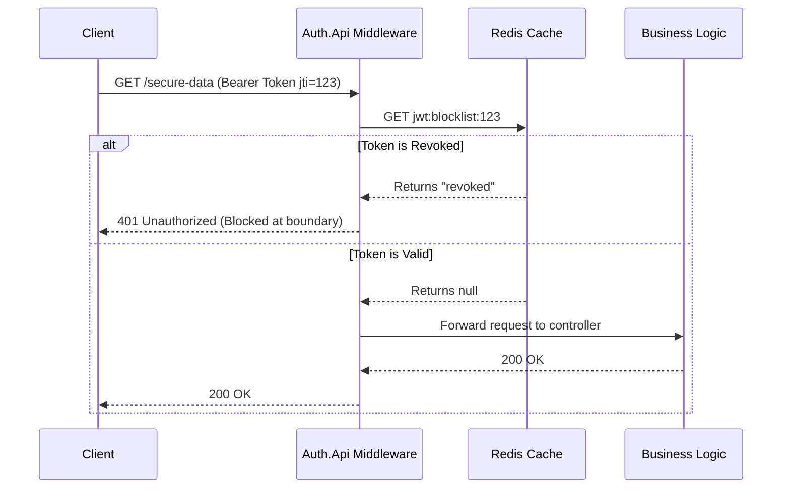

# ADR 006: Stateless JWT Blocklist with Redis

## Status
Accepted

## Context
JSON Web Tokens (JWTs) are inherently *stateless*. This means once `Auth.Api` issues an Access Token, the server does not need to look it up in a database to verify it. Any downstream microservice can independently verify the token using the RSA Public Key (JWKS). 

However, this creates a major security flaw: **How do you log a user out?** 
If an attacker steals a user's access token, and the user clicks "Logout", the token remains valid until it naturally expires (e.g., 15 minutes). The downstream services will still accept it because the signature is still valid.

## Decision
I decided to implement a **JWT Blocklist using Redis Cache**.

1. When generating a token, we embed a unique identifier `jti` (JWT ID).
2. When a user clicks `/logout`, we extract the `jti` and push it to a Redis distributed cache with a Time-To-Live (TTL) equal to the token's remaining lifespan.
3. We added an `OnTokenValidated` event hook in the JWT Authentication middleware. For every authenticated API request, we quickly check the Redis cache for the `jti`. 
4. If the `jti` is found in Redis, the request is instantly rejected with `401 Unauthorized`.

## Consequences
* **Pros:** 
  * Closes the stolen token security loophole. Users are instantly and forcefully logged out.
  * Redis is extremely fast (in-memory). Checking a cache on every request adds less than 1ms of latency compared to checking a PostgreSQL database.
  * We don't store *valid* tokens, only *revoked* ones, keeping the cache size very small.
* **Cons:** 
  * Introduces a new infrastructure dependency (Redis).
  * We lose *pure* statelessness since we now have to ping a centralized cache on every API request.

## Diagram

