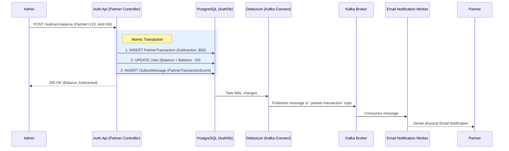

# ADR 007: Partner Role System and Revenue Tracking

## Status
Accepted

## Context
The platform requires a system to support "Partners"—users who have premium status and act as promoters or affiliates. A key business requirement is that a user can register via a partner (linking their account for life), and when that user makes purchases on the platform, 5% of the revenue is attributed to the partner's "bank" balance. Admins need a way to track these additions and manually subtract funds when a real-world payout is processed. The system must also notify the partner via email of any balance changes.

## Decision
We implemented a robust **Partner System** embedded within the Identity context, utilizing Clean Architecture and the Outbox Pattern:

1. **RBAC Integration:** We introduced a new `Partner` role to `Auth.Domain.Rules.Roles`. This role is protected (only assignable by Admins) and implicitly grants premium capabilities within downstream services.
2. **Schema Enhancements:**
   - Added `ReferredByPartnerId` and `PartnerBalance` to the core `User` entity.
   - Introduced a `PartnerTransaction` entity (linked via a 1:N relationship with `User`) to maintain an immutable append-only log of every balance change (Addition/Subtraction) and its description.
3. **Registration Hook:** During registration, if a `PartnerEmail` is provided, the API locates the partner, verifies they have the `Partner` role, and permanently links the new user by assigning their ID to the new user's `ReferredByPartnerId`.
4. **Transactions and API:** 
   - Internal bounded contexts (like a Billing service) can invoke an addition to the balance. 
   - A `PartnerController` was created exposing a `GET /api/partners/me` for partners to view their balance and ledger, and a `POST /api/partners/{partnerId}/subtract-balance` for Admins to register manual payouts.
5. **Decoupled Notifications (Outbox Pattern):**
   - We must not tightly couple the Identity API with a slow SMTP email service.
   - Every time a balance is changed (added or subtracted), the `PartnerRepository` saves the change AND writes a `PartnerTransactionEvent` payload directly to the `OutboxMessages` table in a single transactional unit.
   - Debezium (running via Kafka Connect) tails the PostgreSQL WAL and streams these outbox events to a Kafka Topic instantly, ensuring zero message loss and complete decoupling. A separate Email Worker microservice handles the actual email delivery.

## Consequences
* **Pros:**
  * Clean, transactionally safe ledger system using EF Core `DbContext`.
  * Complete separation of concerns: The Auth API doesn't know how to send emails, it just securely triggers events via the Outbox table.
  * Easy integration with downstream services (e.g., Billing) which can rely on the central user ledger.
* **Cons:**
  * Increases the responsibility of the `Auth.Api` service, leaning slightly toward a monolithic identity boundary. If the partner system grows significantly complex, it may need to be extracted into its own dedicated `Partner.Api` microservice.

## Diagram

