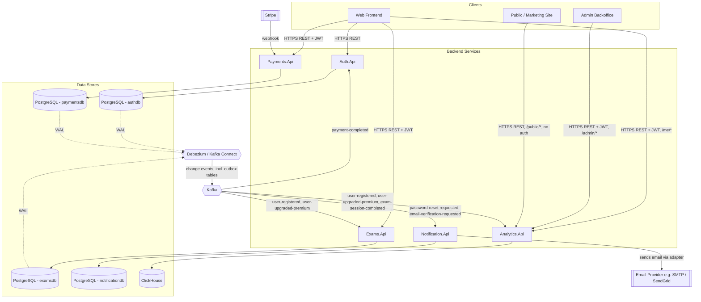
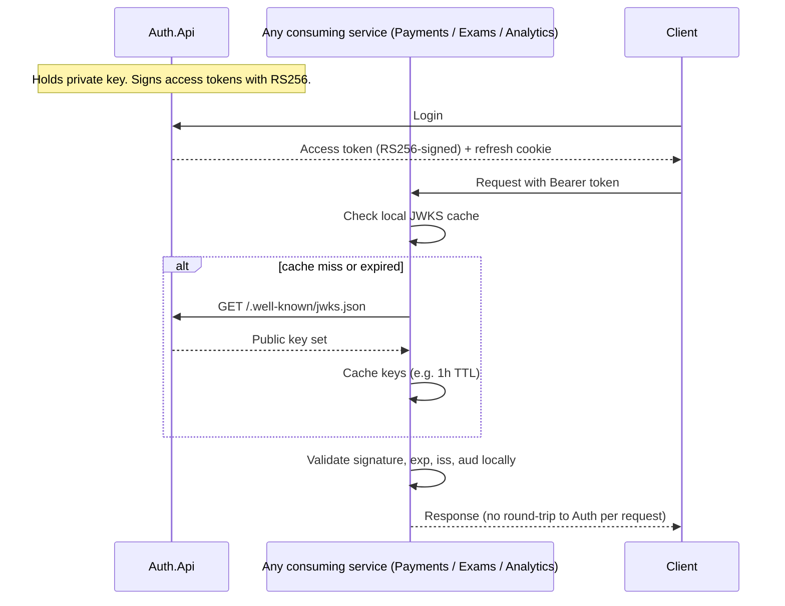
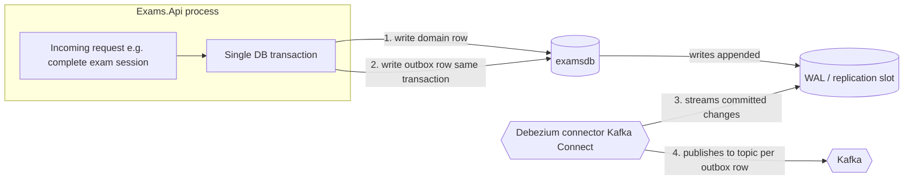
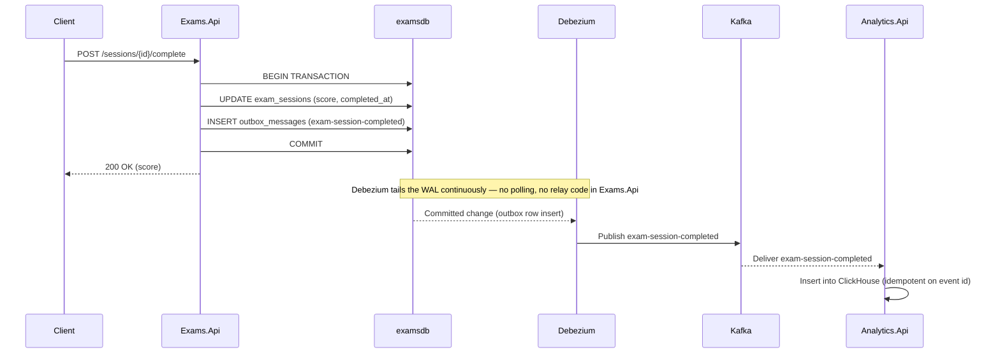
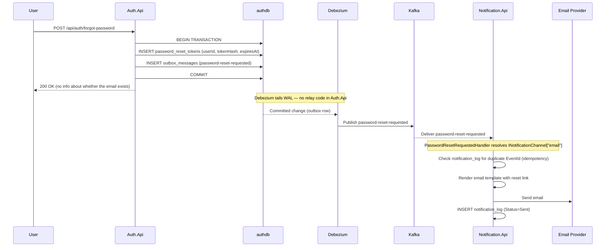
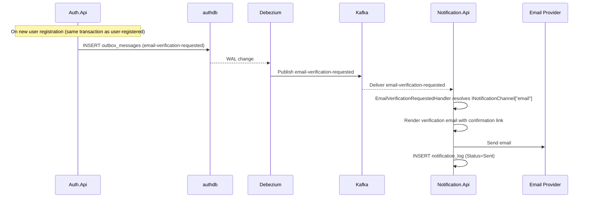
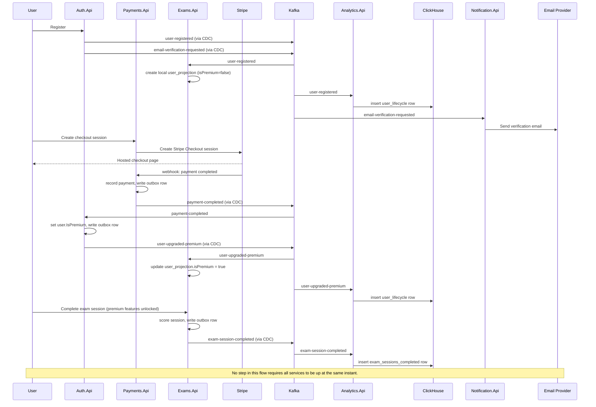

# ExamPrep — Backend Architecture Planning Document

**Status:** Pre-development / architecture planning
**Scope:** Backend only (Auth.Api, Payments.Api, Exams.Api, Analytics.Api, Notification.Api, and shared infrastructure). Frontend, mobile, and deployment/CI concerns are out of scope for this document.

---

## 1. Goals of This Document

- Define service boundaries and each service's single responsibility.
- Define how services communicate, and what is synchronous vs asynchronous.
- Define data ownership per service — no shared database, no cross-service joins.
- Specify the JWT strategy (asymmetric signing), the outbox pattern via CDC, and the payments abstraction before any code is written, since all three are structural decisions that are expensive to retrofit.
- Give the team a shared diagrammatic reference for onboarding and review.

---

## 2. Service Inventory

| Service | Single Responsibility | Owns Data | Exposes |
|---|---|---|---|
| **Auth.Api** | Identity: registration, login, credential verification, token issuance/rotation, and the **entitlement state** (is this user premium, until when) that other services rely on | `users`, `refresh_tokens` | REST API (public), signing key pair (private key never leaves this service), JWKS endpoint |
| **Payments.Api** | Payment/subscription processing, abstracted from the specific provider: today Stripe, designed to accommodate additional providers later without changing consumers | `payments`, `subscriptions`, `provider_accounts` (per-provider metadata) | REST API (checkout session creation, payment history), provider webhook endpoints (e.g. `/webhooks/stripe`) |
| **Exams.Api** | Exam domain: study areas, chapters, questions, options, exam sessions, answers, scoring, rate limits | `study_areas`, `chapters`, `questions`, `options`, `exam_sessions`, `session_answers`, `user_projection` (local read model), `daily_usage` | REST API (public) |
| **Analytics.Api** | Aggregation and reporting, at three access levels: admin dashboards (full detail), authenticated end users (their own stats), and public (aggregate, non-identifying stats e.g. platform-wide numbers on a marketing page | ClickHouse tables (event-sourced, no writes accepted from clients) | REST API — segmented into `/admin/*`, `/me/*`, and `/public/*` route groups with different auth requirements |
| **Notification.Api** | Delivery of notifications to users. Initial channel: email (password reset, email verification). Designed to support additional channels (push, SMS, in-app) and additional event types without modifying existing consumers or channels | `notification_log` (record of sent notifications, status, and channel) | No public REST API — consumes Kafka events exclusively; internal health/readiness endpoint only |

Each service is deployable, scalable, and restartable independently. No service holds a connection string to another service's database.

**Why Payments is its own service rather than living in Auth.Api:** provider integration (webhook verification, checkout session creation, refunds, provider-specific metadata) is a different concern from identity, and is the part most likely to grow — a second provider (e.g. a regional payment method, or a mobile app store's billing API) should be addable by extending Payments.Api's provider abstraction without touching Auth.Api at all. Auth.Api stays the single source of truth for "is this user entitled to premium," but it learns that fact from Payments.Api's events rather than knowing anything about how the payment was taken.

**Why Notification.Api is its own service:** notification delivery is a separate concern from the services that *trigger* the need for a notification. Auth.Api should not know about email templating, SMTP configuration, or delivery retry logic. Notification.Api decouples the "what happened" (the event, e.g. `password-reset-requested`) from the "how to tell the user" (the channel and template). This separation means that adding push notifications or SMS later requires changes only inside Notification.Api, and swapping email providers (e.g. from SMTP to SendGrid to AWS SES) is a single-adapter swap behind an interface, invisible to every other service.

---

## 3. Repository / Project Structure

```
examprep/
├── docs/
│   ├── architecture/              ← this document and future ADRs
│   └── event-catalog.md
├── infra/
│   ├── docker-compose.yml
│   ├── docker-compose.override.yml    (local dev hot-reload settings)
│   ├── postgres/
│   │   └── init-multiple-dbs.sh
│   └── debezium/
│       └── connector-configs/         (one Debezium connector config per source database)
├── services/
│   ├── Auth.Api/
│   │   ├── Auth.Api.sln
│   │   ├── Auth.Api/                  (host: thin HTTP controllers, DI wiring via Extensions/)
│   │   ├── Auth.Domain/               (value objects, domain rules — no external dependencies)
│   │   ├── Auth.Application/          (use-case orchestration, port interfaces, result/event types)
│   │   ├── Auth.Infrastructure/       (EF Core, ASP.NET Identity, JWT, Kafka consumer)
│   │   └── Auth.Api.Tests/
│   ├── Payments.Api/
│   │   ├── Payments.Api.sln
│   │   ├── Payments.Api/
│   │   ├── Payments.Domain/            (provider-agnostic payment/subscription rules)
│   │   ├── Payments.Providers.Stripe/  (Stripe-specific adapter, isolated behind an interface)
│   │   ├── Payments.Infrastructure/    (EF Core; no outbox relay code — see §6, CDC-based)
│   │   └── Payments.Api.Tests/
│   ├── Exams.Api/
│   │   ├── Exams.Api.sln
│   │   ├── Exams.Api/
│   │   ├── Exams.Domain/
│   │   ├── Exams.Infrastructure/
│   │   └── Exams.Api.Tests/
│   ├── Analytics.Api/
│   │   ├── Analytics.Api.sln
│   │   ├── Analytics.Api/              (route groups: Admin/, Me/, Public/)
│   │   ├── Analytics.Infrastructure/   (Kafka consumers, ClickHouse writers)
│   │   └── Analytics.Api.Tests/
│   └── Notification.Api/
│       ├── Notification.Api.sln
│       ├── Notification.Api/           (host: DI wiring, health endpoint — no public REST routes)
│       ├── Notification.Application/   (use-case handlers per event type, port interfaces)
│       ├── Notification.Infrastructure/ (EF Core for notification_log, email channel adapter, Kafka consumers)
│       └── Notification.Api.Tests/
├── contracts/
│   └── events/                        (versioned event schema definitions, shared reference — not a shared runtime dependency)
│       ├── user-registered.v1.md
│       ├── password-reset-requested.v1.md
│       ├── email-verification-requested.v1.md
│       ├── payment-completed.v1.md
│       ├── user-upgraded-premium.v1.md
│       └── exam-session-completed.v1.md
└── keys/
    └── jwt/                           (dev-only key material; production keys live in a secrets manager, never in the repo)
```

**Design intent behind this layout:**
- Each service is a self-contained solution — a team could extract any one into its own repository later with minimal friction.
- `Payments.Providers.Stripe` is deliberately isolated as its own project inside Payments.Api — adding a second provider means adding a sibling project (`Payments.Providers.<NewProvider>`) implementing the same internal interface, not modifying Stripe-specific code.
- `Domain` and `Infrastructure` are separated per service so business rules (scoring formula, rate-limit rules, entitlement rules) don't depend on EF Core or Kafka client libraries.
- An `Application` layer sits between the host project and Infrastructure. It defines all port interfaces (`IUserRepository`, `ITokenService`, etc.), use-case services (`AuthService`), domain events (`UserRegisteredEvent`), and result types. Infrastructure implements these interfaces; controllers depend only on the interfaces, never on concrete Infrastructure types.
- `infra/debezium` holds connector configuration as data, not application code — each service's database gets a Debezium connector pointed at it; the services themselves contain no outbox-relay logic (see §6).
- `contracts/events` holds human-readable schema definitions, not shared code, so producers and consumers can evolve independently.
- `Notification.Api` has no `Notification.Domain` project because it has no domain logic of its own — it reacts to facts that already happened elsewhere. Its Application layer holds the handler interfaces and notification models; Infrastructure holds the channel adapters and Kafka consumers.

---

## 4. High-Level Architecture



Key properties of this diagram:
- **No arrows go directly between Auth.Api, Payments.Api, Exams.Api, Analytics.Api, or Notification.Api.** All cross-service communication is mediated by Kafka.
- The only synchronous, direct external integrations are Stripe's webhook into Payments.Api and Notification.Api's outbound calls to the email provider.
- Debezium reads each service's write-ahead log directly — no service contains outbox-relay code.
- Notification.Api exposes **no public REST endpoints** — it is a pure Kafka consumer that fans events out to delivery channels.

---

## 5. JWT Strategy — Asymmetric Signing (RS256)

### Why asymmetric instead of a shared secret

With a shared HMAC secret, every service that needs to *validate* a token also holds the ability to *forge* one, since the same key does both. That means the signing secret would need to be distributed to Payments.Api, Exams.Api, and Analytics.Api, widening the blast radius of a leak and coupling every service's secret-rotation schedule together.

With RS256, Auth.Api holds a private key that never leaves it. Every other service only needs the corresponding **public key**, which is safe to distribute or fetch openly.

### Key distribution approach: JWKS endpoint



**Key properties of this approach:**
- Every service that needs to authenticate a request validates tokens **locally**, with no synchronous call to Auth.Api on the request hot path.
- Key rotation on Auth.Api's side (publishing a new key, retiring an old one after a grace period) doesn't require redeploying any other service — they just re-fetch the JWKS document.
- Token claims carry what's needed to authorize a request without a database lookup on Auth's side: `sub` (user id), `email`, `isPremium` (as of token issuance), `exp`, `iat`.
- `Analytics.Api`'s `/public/*` routes explicitly skip JWT validation — they're the one route group designed for anonymous access, and should be careful to only ever return aggregate, non-identifying data.
- **Notification.Api does not validate JWTs** — it has no public endpoints, so it never receives a Bearer token. It authenticates events by virtue of receiving them from the internal Kafka cluster.

**Open point to confirm:** access tokens are short-lived (e.g. 15 minutes), so an `isPremium` claim baked into the token can go stale for up to that window after an upgrade. Exams.Api's own `user_projection` table (kept current via the `user-upgraded-premium` event) is the authoritative source for premium checks — the JWT claim should be treated as a hint, not the source of truth, for any premium-gated endpoint.

---

## 6. Outbox Pattern via Change Data Capture (Debezium)

### Problem being solved

A service that writes to its own database and then separately publishes to Kafka has two non-atomic steps. A crash, timeout, or broker unavailability between the two leaves the database updated but the event unsent — other services silently never learn what happened.

### Adopted approach: CDC, not a polling relay

Rather than each service running its own background worker that polls an `outbox_messages` table and publishes on an interval, this system adopts **Debezium** connectors reading directly from each database's write-ahead log (WAL). This removes the relay entirely as application code:





### Why CDC over a polling relay

- **No relay code to write or operate per service** — the outbox table still exists (for transactional atomicity with the domain write) but nothing in the application polls it; Debezium does that by tailing the WAL, which is lower-latency and removes a class of "is the relay running / did it crash" operational concerns.
- **Single connector pattern reused across all three write-owning services** (Auth.Api, Payments.Api, Exams.Api) — one Debezium connector configuration per database, using Debezium's [outbox event router](https://debezium.io/documentation/reference/stable/transformations/outbox-event-router.html) transform to turn outbox table rows directly into correctly-topic-routed Kafka messages.
- **Trade-off accepted:** this adds Kafka Connect + Debezium as infrastructure to operate (connector health, replication slot management, WAL retention on Postgres) in exchange for removing bespoke relay code and its failure modes from every service.

### Design decisions this implies

- Every write-owning service (Auth.Api, Payments.Api, Exams.Api) still writes to its own `outbox_messages` table in the same transaction as the domain change — CDC replaces *how the row gets to Kafka*, not the transactional-outbox table itself.
- Postgres logical replication must be enabled per database, with a dedicated replication slot per Debezium connector.
- Because delivery is at-least-once (Debezium/Kafka Connect can redeliver on connector restart), every consumer must treat inbound events as **idempotent**, deduplicated by event id — this is why the ClickHouse tables in Analytics.Api key on the source event/entity id.
- Connector configuration (which tables, which transform, target topic naming) lives in `infra/debezium/connector-configs/`, version-controlled alongside the schema it reads from.
- **Notification.Api does not write an outbox** — it is a pure consumer. It never produces events that other services need to react to. Its own `notification_log` table is written transactionally for auditing and retry tracking but is not a Debezium source.

---

## 7. Event Catalog (Summary)

| Topic | Producer | Consumers | Fires when |
|---|---|---|---|
| `user-registered` | Auth.Api | Exams.Api, Analytics.Api | A new account is created |
| `password-reset-requested` | Auth.Api | Notification.Api | A user initiates the password reset flow |
| `email-verification-requested` | Auth.Api | Notification.Api | A new account is created and requires email verification, or a user requests re-sending the verification email |
| `payment-completed` | Payments.Api | Auth.Api | A provider (Stripe today, others later) confirms a successful payment |
| `user-upgraded-premium` | Auth.Api | Exams.Api, Analytics.Api | Auth.Api applies entitlement after consuming `payment-completed` |
| `exam-session-completed` | Exams.Api | Analytics.Api | A practice session is scored and finalized |
| `study-area-deleted` *(proposed)* | Exams.Api | Analytics.Api | Admin force-deletes a study area, so historical aggregates can be marked/excluded rather than orphaned |
| `question-imported` *(proposed)* | Exams.Api | Analytics.Api | A bulk JSON import completes, for usage/volume reporting |

`payment-completed` is deliberately provider-agnostic in shape (amount, currency, provider name, plan/duration purchased, user id) — Auth.Api never needs to know or care whether the underlying provider was Stripe or something added later.

`password-reset-requested` and `email-verification-requested` carry only what Notification.Api needs to compose and send the email: `userId`, `email`, and a `token` (the short-lived, single-use value to embed in the link). They deliberately contain nothing about how the notification should be delivered — that is Notification.Api's concern, not the producer's.

Full field-level schemas belong in `contracts/events/*.md`, versioned independently per topic (`v1`, `v2`, …) so producers and consumers can evolve without a synchronized deploy.

---

## 8. Notification.Api — Design Deep Dive

### 8.1 Responsibility and Boundaries

Notification.Api owns exactly one concern: **given an event, deliver a notification to the appropriate user via the appropriate channel(s)**. It does not:
- Decide *whether* a notification should be sent (the producing service decides that by publishing the event).
- Hold any business logic about users, exams, or payments.
- Expose any endpoint that a frontend or another service calls directly.

Its single responsibility makes it naturally small and easy to reason about. The complexity it *does* own is channel-specific: template rendering, delivery retry, per-user preferences (future), and provider-specific SDKs.

### 8.2 Internal Architecture (Clean / Layered)

Following the same layered structure as Auth.Api:

```
Notification.Api/            ← host: DI wiring, health endpoint, appsettings
Notification.Application/    ← event handlers (use cases), port interfaces, models
Notification.Infrastructure/ ← Kafka consumers, email channel adapter, EF Core, notification_log
```

**`Notification.Application` layer** defines:

- `INotificationChannel` — the channel abstraction. Every channel (email, push, SMS) implements this interface. The Application layer depends only on the interface, never on a concrete transport.

  ```csharp
  // Notification.Application/Interfaces/INotificationChannel.cs
  public interface INotificationChannel
  {
      string ChannelName { get; }  // "email", "push", "sms"
      Task SendAsync(NotificationMessage message, CancellationToken ct = default);
  }
  ```

- `INotificationLogRepository` — port for persisting the notification log (sent, failed, retrying).

- `INotificationHandler<TEvent>` — one handler per event type. Handlers are registered in DI and resolved by the Kafka consumer dispatcher based on the incoming topic name. This is the Open/Closed principle in practice: adding a new event that needs a notification means adding a new `INotificationHandler<TNewEvent>` implementation, not modifying existing handlers.

  ```csharp
  // Notification.Application/Interfaces/INotificationHandler.cs
  public interface INotificationHandler<TEvent>
  {
      Task HandleAsync(TEvent @event, CancellationToken ct = default);
  }
  ```

- `NotificationMessage` — the channel-agnostic DTO that handlers produce and pass to a channel:

  ```csharp
  // Notification.Application/Models/NotificationMessage.cs
  public record NotificationMessage(
      string Recipient,  // e.g. email address, device token
      string Subject,    // channel-specific: email subject line, push title
      string Body,       // rendered text / HTML
      string Channel,    // "email" | "push" | "sms"
      string EventId     // for idempotency / deduplication in the log
  );
  ```

**`Notification.Infrastructure` layer** implements:

- `EmailChannel : INotificationChannel` — wraps the SMTP or provider SDK. Swapping from SMTP to SendGrid is a one-class change here, invisible to the Application layer.
- `KafkaConsumerDispatcher` — connects to Kafka, deserializes the event payload, resolves the correct `INotificationHandler<T>` from DI, and invokes it. Handles offset commits after successful processing.
- `NotificationLogRepository : INotificationLogRepository` — EF Core repository for `notification_log`.
- `NotificationDbContext` — EF Core context for `notificationdb` (Postgres).

### 8.3 Data Ownership

Notification.Api owns a single table: `notification_log`.

| Column | Type | Description |
|---|---|---|
| `Id` | UUID | Primary key |
| `EventId` | string | The originating event's id — used for idempotency; a duplicate delivery of the same event id is a no-op |
| `Topic` | string | The Kafka topic that triggered this notification (e.g. `password-reset-requested`) |
| `Channel` | string | The delivery channel used (e.g. `email`) |
| `Recipient` | string | The channel-specific destination (e.g. email address) |
| `Status` | enum | `Pending`, `Sent`, `Failed` |
| `SentAt` | datetime? | UTC timestamp of successful delivery |
| `FailureReason` | string? | Error detail if delivery failed |
| `CreatedAt` | datetime | UTC timestamp when the log row was created |

**Why log?** Notification delivery is inherently unreliable (SMTP timeouts, provider outages). The log provides:
1. An audit trail ("was the password reset email sent, and when?").
2. A basis for retry logic (query `Status = Failed` and re-attempt, bounded by a max-retry count).
3. Deduplication: if Kafka redelivers the same event (at-least-once semantics), the handler checks whether a log row with the same `EventId` and `Channel` already has `Status = Sent` and skips re-delivery.

### 8.4 Adding a New Event — Step-by-Step

The design is intentionally open for extension and closed for modification (OCP). Adding a new event that requires a notification involves:

1. **Add the event contract** — create `contracts/events/<new-topic>.v1.md`.
2. **Add the Kafka topic** to the event catalog (§7).
3. **In `Notification.Application`** — add a new event model (e.g. `SomeNewEvent`) and a new handler implementing `INotificationHandler<SomeNewEvent>`.
4. **In `Notification.Infrastructure`** — register the new topic → handler mapping in `KafkaConsumerDispatcher`. No existing handler is modified.
5. **In `Notification.Api`** — register the new handler in DI.

No existing handler, channel adapter, or infrastructure component needs modification.

### 8.5 Adding a New Channel — Step-by-Step

Adding a delivery channel (e.g. push notifications) is equally bounded:

1. **In `Notification.Infrastructure`** — implement `INotificationChannel` (e.g. `PushChannel`).
2. **In `Notification.Api`** — register it in DI.
3. **In the relevant handler(s)** — resolve the new channel by `ChannelName` and call `SendAsync`. Handlers can fan out to multiple channels if needed.

The email channel implementation, the Kafka consumer, and all other handlers remain untouched.

### 8.6 Event Flow: Password Reset



Key design decisions visible in this flow:
- Auth.Api writes the outbox row in the **same transaction** as the `password_reset_tokens` row — atomicity guaranteed.
- Auth.Api returns `200 OK` regardless of whether the email exists (prevents user enumeration).
- Notification.Api checks for duplicate delivery before sending (idempotency on `EventId`).
- The reset link token itself lives only in Auth.Api's database. Notification.Api receives the raw (pre-hashed) token to embed in the link URL; Auth.Api stored only the hash. This matches how refresh tokens are handled.

### 8.7 Event Flow: Email Verification



Note that `email-verification-requested` can be produced alongside `user-registered` in the same outbox batch (two rows in the same transaction), or as a separate flow when a user requests a re-send. Both cases are handled by the same handler in Notification.Api.

---

## 9. Cross-Service Flow: Registration → Payment → Premium → Exam → Analytics



---

## 10. Analytics.Api Access Levels

Since Analytics.Api now serves three different audiences from the same ClickHouse-backed data, its routes are explicitly segmented:

| Route group | Audience | Auth requirement | Example data |
|---|---|---|---|
| `/admin/*` | Internal admin/backoffice | JWT + admin role claim | Per-study-area performance, premium conversion funnel, moderation stats, full user lifecycle timelines |
| `/me/*` | Authenticated end users | JWT (any authenticated user) | The requesting user's own exam history, score trends, study streaks |
| `/public/*` | Anonymous / marketing site | None | Platform-wide aggregate counters only (e.g. total exams taken, number of study areas) — never anything that could identify an individual user |

`/public/*` endpoints need explicit review before adding new ones, since it's the one surface where an aggregation query mistake (e.g. a `GROUP BY` with too fine a granularity) could leak individual-level data. A general rule worth adopting: any `/public/*` query result should be suppressed or bucketed if the underlying group size is below a small threshold (e.g. fewer than 5 users), rather than returned as-is.

---

## 11. Infrastructure Components

| Component | Role |
|---|---|
| PostgreSQL (`authdb`) | Transactional store for Auth.Api |
| PostgreSQL (`paymentsdb`) | Transactional store for Payments.Api |
| PostgreSQL (`examsdb`) | Transactional store for Exams.Api |
| PostgreSQL (`notificationdb`) | Transactional store for Notification.Api (`notification_log` table) |
| ClickHouse | Append-only analytical store for Analytics.Api |
| Kafka | Event backbone; topics listed in §7 |
| Kafka Connect + Debezium | CDC layer streaming outbox-table changes from each Postgres database into Kafka |
| Email Provider (SMTP / SendGrid / SES) | External email delivery; contacted only by Notification.Api's `EmailChannel` adapter |
| Docker Compose | Local orchestration of the above for development |

Each PostgreSQL database is logically isolated even though they may share a physical Postgres instance in local development — production should consider separate instances per service once load justifies it, and each needs logical replication enabled for its Debezium connector.

**Note on `notificationdb`:** Notification.Api's database does **not** need a Debezium connector — Notification.Api is a consumer, not a producer. Its database does not need logical replication enabled.

---

## 12. Non-Functional Concerns to Design For

- **Idempotent consumers**: every Kafka consumer must be safe to re-process the same message (at-least-once delivery from Debezium/Kafka Connect and from Kafka's own consumer-group semantics). Notification.Api specifically deduplicates on `EventId` in `notification_log` before attempting delivery.
- **Dead-letter handling**: a consumer that repeatedly fails to process a message (e.g. malformed payload, email provider down) should route it to a dead-letter topic rather than blocking the partition indefinitely. Notification.Api should apply a bounded retry policy (e.g. 3 attempts with exponential back-off) before sending to a DLQ.
- **Connector health**: Debezium connector status, replication slot lag, and WAL retention need monitoring — an unmonitored stuck connector is a silent event-delivery gap.
- **Health checks**: each service exposes liveness/readiness endpoints, including checks on its database connection and Kafka connectivity. Notification.Api additionally checks the reachability of its configured email provider.
- **Observability**: correlation/trace IDs should propagate from the originating HTTP request through to the Kafka message headers, so a single flow (e.g. registration → email verification → confirmed) can be traced across services.
- **Schema evolution**: event contracts are additive-only within a version (new optional fields); breaking changes require a new topic version and a dual-publish/migration window.
- **Key rotation**: Auth.Api's JWKS endpoint should support publishing a new key alongside the old one for a grace period, so in-flight tokens signed with the old key remain valid until they naturally expire.
- **Public endpoint data minimization**: as noted in §10, `/public/*` analytics routes need a deliberate review step to avoid aggregate queries that inadvertently expose individual-level data.
- **Notification privacy**: Notification.Api receives tokens (password reset, email verification) as part of event payloads. These tokens must not be logged beyond what is needed for the `notification_log` record, and they should be short-lived (e.g. 1 hour for password reset, 24 hours for email verification).
