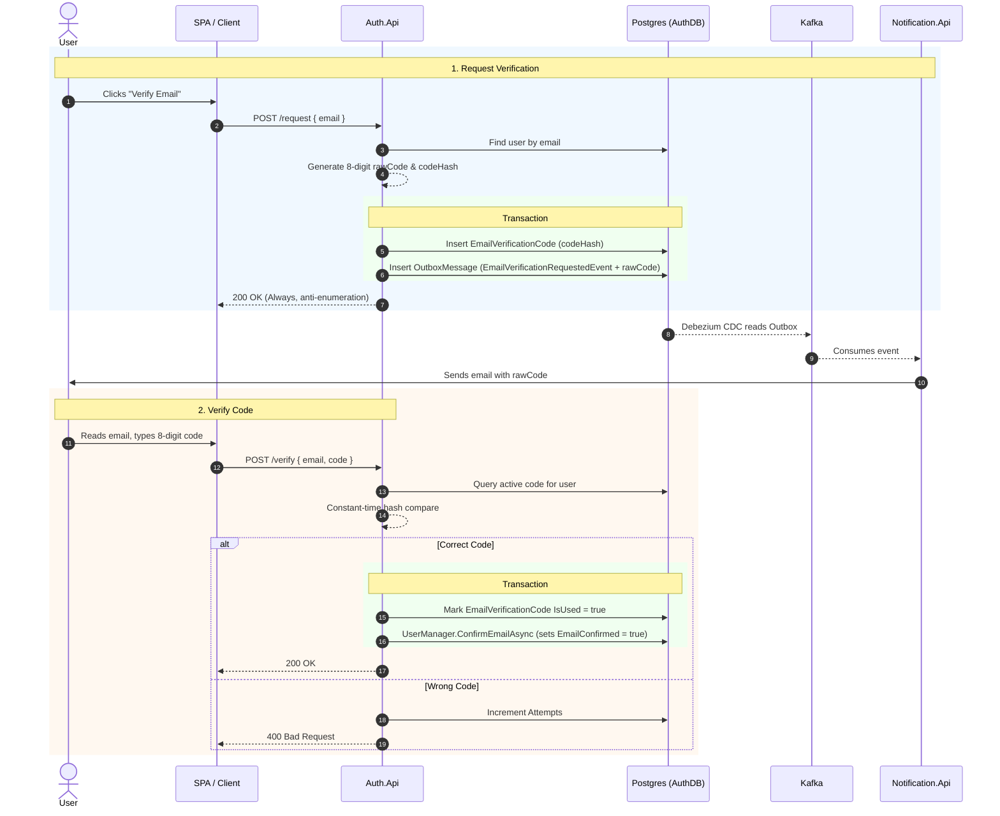

# Email Verification Flow

This document details the architecture, design decisions, and sequence flow for the two-step email verification feature implemented in `Auth.Api`.

## 1. Overview and Architecture

The email verification feature ensures that a user owns the email address they registered with. It is highly similar in design to the Password Reset flow, prioritizing security against timing and brute-force attacks.

### The Two-Step Process

1.  **Request (`POST /api/auth/email-verification/request`)**
    *   Generates an 8-digit OTP code, hashes it using SHA-256, and stores it in the database (`EmailVerificationCode`).
    *   Publishes an `email-verification-requested` event to the transactional outbox, containing the raw code.
    *   `Notification.Api` consumes this event via Kafka and emails the user.
    *   **Security:** Always returns `200 OK` for unknown emails to prevent account enumeration. If the user is already verified, it gracefully returns a specific "AlreadyVerified" status.

2.  **Verify (`POST /api/auth/email-verification/verify`)**
    *   Validates the user's submitted 8-digit code against the stored hash.
    *   **Security:** Uses constant-time comparison (`CryptographicOperations.FixedTimeEquals`) to prevent timing attacks. Enforces a maximum of 5 failed attempts before locking the code.
    *   On success, burns the OTP code (marks it `IsUsed = true`) and marks the user's email as confirmed via ASP.NET Core Identity (`EmailConfirmed = true`).

## 2. Sequence Diagram

## 3. Entity Models

### EmailVerificationCode
*   `CodeHash`: SHA-256 hash of the 8-digit OTP.
*   `Attempts`: Integer tracking failed `/verify` attempts.
*   `IsUsed`: Boolean marking the code as burnt after a successful verify.
*   `ExpiresAt`: Timestamp (default 15 minutes TTL).
