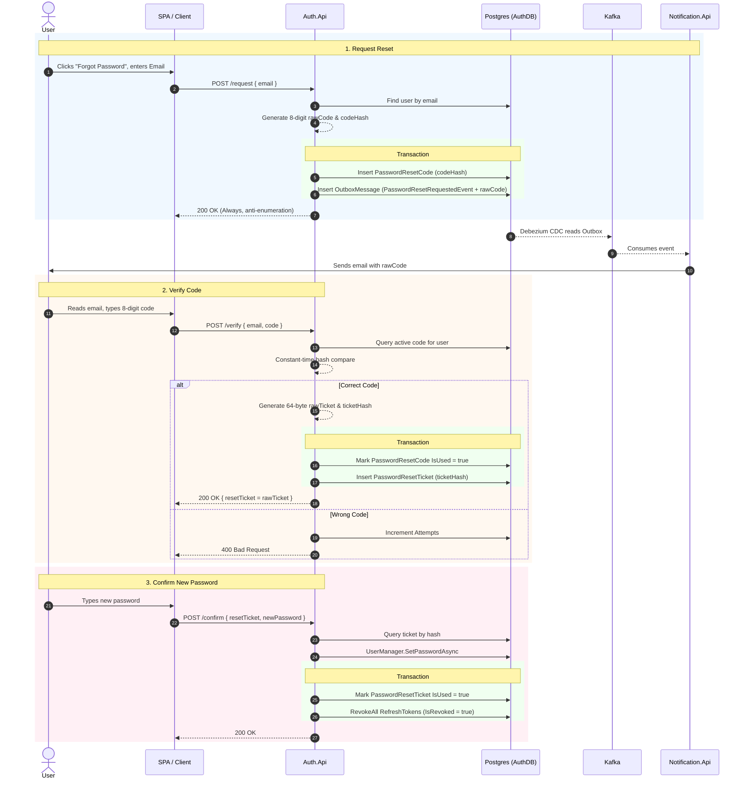

# Password Reset Flow

This document details the architecture, design decisions, and sequence flow for the three-step password reset feature implemented in `Auth.Api`.

## 1. Overview and Architecture

The password reset feature is designed to be highly secure, resistant to brute-force and timing attacks, and to prevent account enumeration. It separates the proof-of-identity step (OTP verification) from the actual password change step by using a short-lived cryptographic ticket.

### The Three-Step Process

1.  **Request (`POST /api/auth/password-reset/request`)**
    *   Generates an 8-digit OTP code, hashes it using SHA-256, and stores it in the database (`PasswordResetCode`).
    *   Publishes a `password-reset-requested` event to the transactional outbox, containing the raw code.
    *   `Notification.Api` consumes this event via Kafka and emails the user.
    *   **Security:** Always returns `200 OK` regardless of whether the email exists. This prevents attackers from probing the system to discover registered users.

2.  **Verify (`POST /api/auth/password-reset/verify`)**
    *   Validates the user's submitted 8-digit code against the stored hash.
    *   **Security:** Uses constant-time comparison (`CryptographicOperations.FixedTimeEquals`) to prevent timing attacks. Enforces a maximum of 5 failed attempts before locking the code.
    *   On success, burns the OTP code (marks it `IsUsed = true`) and issues a 64-byte `PasswordResetTicket` (returned to the client as Base64, stored in DB as a SHA-256 hash).

3.  **Confirm (`POST /api/auth/password-reset/confirm`)**
    *   Accepts the short-lived `PasswordResetTicket` and the user's new password.
    *   Changes the password via ASP.NET Core Identity.
    *   **Security (Session Fixation):** Revokes all existing `RefreshToken`s for the user. This ensures that any compromised devices or active sessions are immediately invalidated when the password changes.
    *   Burns the ticket (marks it `IsUsed = true`).

## 2. Why Code *and* Ticket? (Design Decision)

The separation between an 8-digit OTP code and a long Base64 ticket solves the conflict between user experience and stateless API security.

*   **The User Experience Need (OTP Code):** Users need something short and easy to type from their email onto another device. An 8-digit number is ideal.
*   **The Security Problem (OTP Code):** An 8-digit number has low entropy (100 million combinations). It must be protected by a strict attempt counter (max 5 tries).
*   **The API Problem (Ticket):** Modern SPAs often separate the "enter code" screen from the "enter new password" screen into two different API calls. We cannot trust the client saying "I verified the code on the previous screen." We also don't want the client holding the 8-digit code in memory to send with the final password, because if the code is still valid, the brute-force risk remains open.
*   **The Solution:** The moment the 8-digit code is verified, we **burn it** so it is useless to attackers. In exchange, the server issues a high-entropy, 64-byte ticket. This ticket proves verification occurred and is mathematically impossible to brute-force. The client silently passes this ticket in the final step.

## 3. Sequence Diagram

## 4. Entity Models

### PasswordResetCode
*   `CodeHash`: SHA-256 hash of the 8-digit OTP.
*   `Attempts`: Integer tracking failed `/verify` attempts.
*   `IsUsed`: Boolean marking the code as burnt after a successful verify.
*   `ExpiresAt`: Timestamp (default 15 minutes TTL).

### PasswordResetTicket
*   `TicketHash`: SHA-256 hash of the 64-byte URL-safe base64 string.
*   `IsUsed`: Boolean marking the ticket as burnt after a successful confirm.
*   `ExpiresAt`: Timestamp (default 10 minutes TTL).
